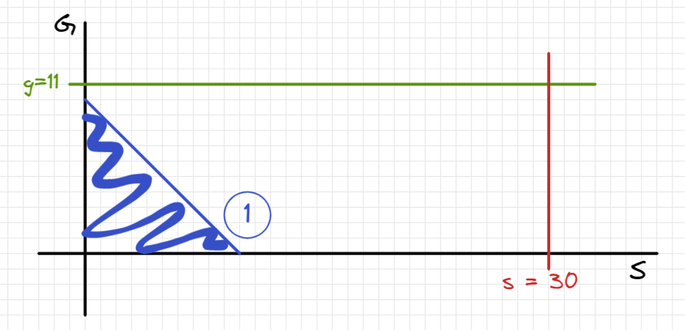
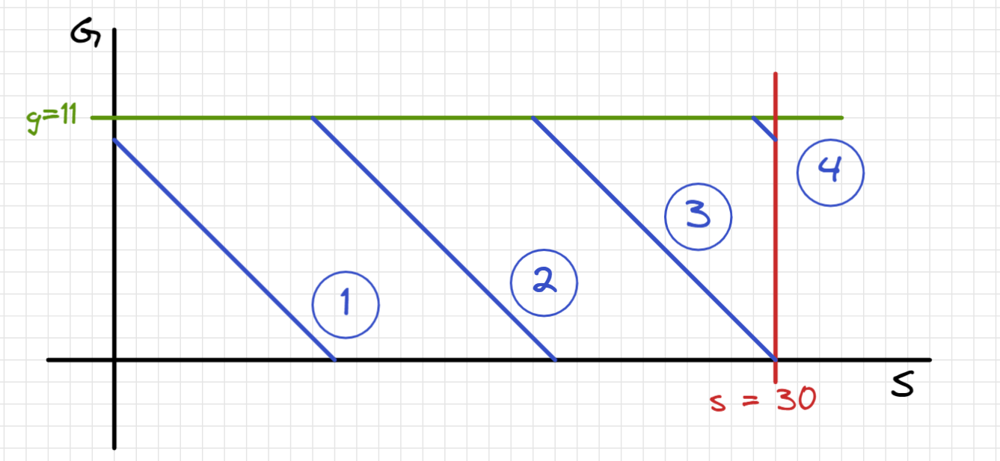

# 금과 은 운반하기

## 기호 설명
* a, A : 도시 건설에 필요한 금의 양[kg]
* b, B : 도시 건설에 필요한 은의 양[kg]
* $\imath$ : 도시 건설을 지원하는 도시의 번호
* $g[\imath]$ : 지원하는 도시 중 $\imath$ 번째 도시에서 보유하고 있는 금의 양[kg]
* $s[\imath]$ : 지원하는 도시 중 $\imath$ 번째 도시에서 보유하고 있는 은의 양[kg]
* $t[\imath]$ : 지원하는 도시 중 $\imath$ 번째 도시에서 건설 현장까지 트럭으로 이동하는데 걸리는 시간
* $w[\imath]$ : 지원하는 도시 중 $\imath$ 번째 도시에서 건설 현장으로 이동하는 트럭이 한번에 실을 수 있는 최대 중량
[kg]$


* s : 이진 탐색의 첫번째 인덱스, 탐색 중인 시간 중 최소 값
* e : 이진 탐색의 마지막 인덱스, 탐색 중인 시간 중 최대 값
* m : 이진 탐색의 가운데 인덱스, 탐색 하는 시간
* infos[$\imath$] : i번째 도시의 정보를 포함하고 있음
  * g : g[$\imath$]
  * s : s[$\imath$]
  * t : t[$\imath$]
  * w : w[$\imath$]
  * notp(number of times possible) :  임의의 시간 m 동안 트럭으로 지원할 수 있는 횟수
  * aw(available weight) : 해당 트럭이 임의의 시간 m 동안 운반할 수 있는 최대 중량 

## 제약 조건
* 0 ≤ a, b ≤ $10^9$
* 1 ≤ g의 길이 = s의 길이 = w의 길이 = t의 길이 = 도시 개수 ≤ $10^5$
  * 0 ≤ g[$\imath$], s[$\imath$] ≤ $10^9$
  * 1 ≤ w[$\imath$] ≤ $10^2$
  * 1 ≤ t[$\imath$] ≤ $10^5$
  * a ≤ g의 모든 수의 합
  * b ≤ s의 모든 수의 합

시간의 최대값을 고민해볼 필요가 있다. 
아래의 조건이라면
* w = 1
* a, b, g, s = $10^9$
* t = $10^5$

트럭이 한번 왕복하는데 걸리는 시간 2 $\cdot 10^5$,    
트럭의 운송 최대 무게가 1[kg]이고, 금과 은 모두 $10^9$[kg]이 필요한 상황이라면 트럭은 $2 * $10^9$번 왕복해야함      
즉, 모두 운반하는데 걸리는 최대 시간은 $4 \cdot 10^14$이다.

모든 경우에 대해 계산하는 경우 시간초과가 발생하므로, 효과적으로 찾을 수 있는 binary search를 이용해야 한다.   
$\log_{2}(4 \cdot 10^14)는 \log_{2}(4) + \log_{2}((2^10)^4) + log_{2}10^2 $이므로, 대략 49회 정도 탐색하면 정확한 시간을 구할 수 있다.

## 풀이 과정
해당 문제에서는 필요한 금과 은을 운반할 수 있는 가장 빠른 시간을 구해야한다.   
탐색 시간은 최대 $4 \cdot 10^14 \cdot 10^5$이므로 완탐으로 하는 경우 시간초과가 발생할 것이다.    
binary search로 모두 운반하는데 가능한 시간을 결정하고, 해당 시간내에 운반할 수 있는지 확인하는 방식으로 문제를 해결한다면 보다 빠르게 문제를 해결할 수 있다.   
이와 같은 방식을 parametric search라고 한다.

그럼 해당 시간에 운반이 가능한지는 어떻게 확인할 수 있을까?   
그래프를 그래서 예시를 확인해보자   
g = 11, s = 30, w = 10, t = 3 인 경우 1회차 운반시 그림은 아래와 같다.   

w는 10이므로 g = -s + 10의 그래프이다. 
① 그래프와 s, g 축으로 감싸진 부분(파란 지렁이가 기어다니는 면적)은 내에 (b, a)가 존재했다면 1회차, 즉 3시간만에 목표를 달성한 것이다.   

한번 씩 운반할 때 마다 아래와 같이 만족할 수 있는 (b, a)의 범위가 넓어진다.

아래는 4회차까지 운반한 결과를 그래프로 나태내었다.


그림과 같이 운반 횟수가 늘어나더라도, 운반한 양(파란선)은 도시가 보유하고 있는 g(초록선)와 s(빨간선)의 최대치를 넘을 수 없다.   
해당 시간에 운반한 g와 최대치는 파란선의 g값과 초록선의 g값 중 작은 값이며,   
s의 최대치는 파란선 s의 값과 빨간선 s값 중 작은 값이다.   
이러한 의미는 아래와 같은 방식으로 나타내었다.   
```java
g += Math.min(infos[i].g, infos[i].aw);
s += Math.min(infos[i].s, infos[i].aw);
```

또한 n회차 운반 결과인 기울기가 -1인 그래프 아래 영역(s축과 g축으로 감싼)이며, 아래의 코드를 의미한다.   
```java
sum += Math.min(infos[i].g + infos[i].s, infos[i].aw);
```

이러한 도시의 정보를 전부 더한 후, (b, a)가 영역 안에 존재한다면 시간내에 a와 b 이상의 자원을 운반했다는 것을 알 수 있다.   
```java
return A <= g && B <= s && A + B <= sum ? true : false;
```

~~그림 그리기 너무 힘들다... 다시는 안 그리고자 한다....~~